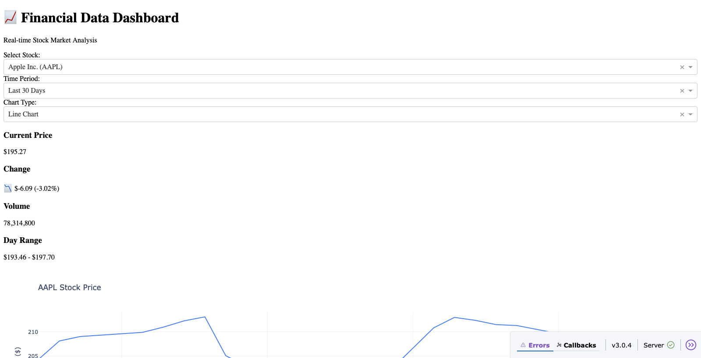
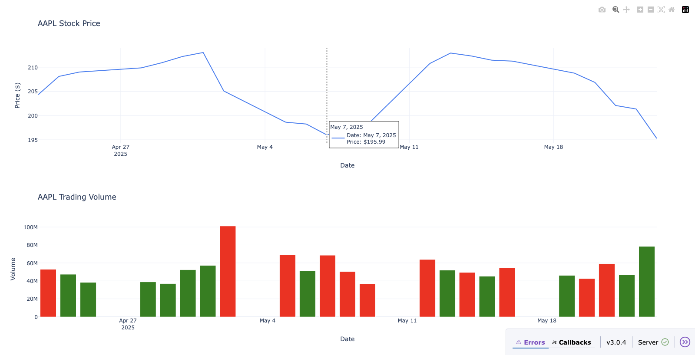

# Interactive Data Dashboard


## 📝 Short Description

A simple yet powerful ETL-based dashboard that collects stock market data, processes it, and stores it for future visualization and analysis.

## 🌟 Overview

**Interactive Data Dashboard** là một hệ thống tự động thu thập dữ liệu chứng khoán từ nhiều nguồn (qua API), xử lý, làm sạch và lưu trữ chúng vào cơ sở dữ liệu SQLite. Hệ thống được thiết kế sẵn sàng để tích hợp vào các dashboard trực quan hóa hoặc các công cụ phân tích dữ liệu nâng cao.

### ⚡ Features

- Thu thập dữ liệu thời gian thực từ nhiều mã cổ phiếu.
- Làm sạch và chuẩn hóa dữ liệu ETL.
- Lưu trữ vào SQLite để sử dụng về sau.
- Tự động chạy định kỳ theo lịch trình.

> 
> 

---

## ⚙️ Requirements

- Python >= 3.9
- `pandas`
- `schedule`
- `sqlite3`
- API key hoặc module `data_collector.py` chứa hàm `get_stock_data`

Cài đặt yêu cầu:

```bash
pip install pandas schedule
```

---

## 🛠️ Công nghệ sử dụng

- Python (pandas, requests, sqlite3)
- SQLite
- Streamlit / Dash (cho dashboard)
- FastAPI / Flask (cho API server)

---

## 📁 Cấu trúc thư mục

```
INTERACTIVE_DATA_DASHBOARD/
│
├── database/                    # Thư mục chứa CSDL SQLite
│   └── stock_data.db           # Cơ sở dữ liệu lưu dữ liệu chứng khoán
│
├── image/                      # Thư mục chứa ảnh minh họa
│
├── src/                        # Source code chính
│   ├── __pycache__/           # Cache Python bytecode
│   ├── data/                   # Dữ liệu CSV gốc
│   │   ├── AAPL_data.csv
│   │   ├── AMZN_data.csv
│   │   ├── GOOGL_data.csv
│   │   ├── META_data.csv
│   │   ├── MSFT_data.csv
│   │   ├── NVDA_data.csv
│   │   ├── TSLA_data.csv
│   │   ├── all_stocks_data.csv
│   │   └── market_summary.csv
│   ├── api_server.py           # API server đơn giản
│   ├── dashboard.py            # Dashboard hiển thị dữ liệu
│   ├── data_collector.py       # Thu thập dữ liệu từ API
│   ├── etl_pipeline.py         # Pipeline chính: thu thập → xử lý → lưu
│   └── load_to_db.py           # Tải dữ liệu CSV vào CSDL
│
└── README.md                   # Tài liệu mô tả dự án
```

---

## 🚀 Hướng dẫn chạy dự án

```bash
# Bước 1: Cài đặt các thư viện cần thiết
pip install -r requirements.txt

# Bước 2: Chạy pipeline ETL để thu thập và xử lý dữ liệu
python src/etl_pipeline.py

# Bước 3: Khởi động dashboard để hiển thị dữ liệu
python src/dashboard.py

# (Tùy chọn) Khởi động API server để truy xuất dữ liệu
python src/api_server.py
```

---

## 📌 Ghi chú

- Có thể mở rộng dự án bằng cách kết nối dữ liệu real-time hoặc tích hợp phân tích nâng cao (forecasting, clustering, v.v).
- Hệ thống có thể triển khai bằng Docker để dễ dàng phân phối.
- Có thể triển khai lên cloud như AWS, Azure, hoặc GCP.

---

## ✅ Testing

Chạy thử các script đơn lẻ để kiểm tra luồng ETL:

```bash
python src/data_collector.py
python src/load_to_db.py
```

---

## 🤝 Contributing

Chúng tôi hoan nghênh mọi ý kiến đóng góp! Vui lòng fork dự án, tạo nhánh và gửi pull request.

---

## ✍️ Authors

- Nguyễn Minh Hùng

---

## 📜 License

This project is licensed under the MIT License.

---

## 🙏 Acknowledgments

- [pandas](https://pandas.pydata.org/)
- [Streamlit](https://streamlit.io/)
- [FastAPI](https://fastapi.tiangolo.com/)
- Stock APIs used for educational purposes only.

---

## 📧 Contact

Nếu bạn có câu hỏi hoặc đề xuất, xin vui lòng liên hệ qua email:

- 📩 Email: hung.nguyenminh.work@gmail.com

